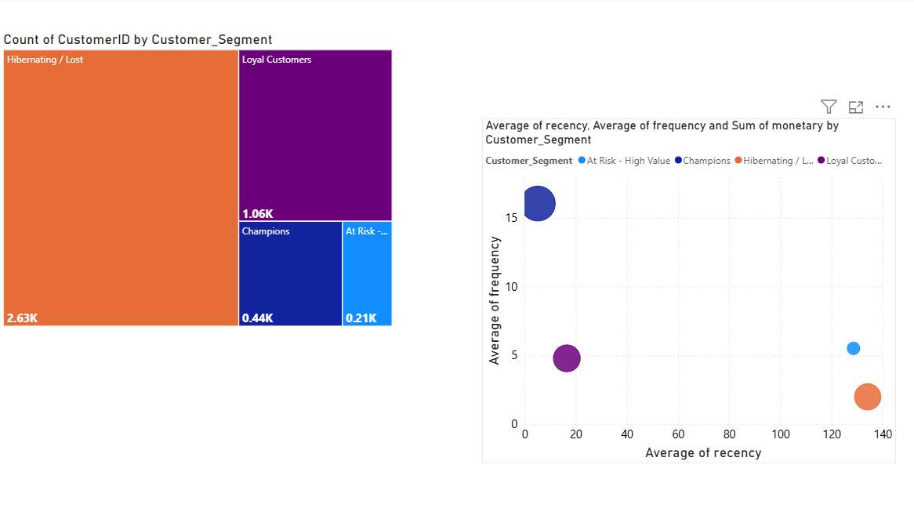
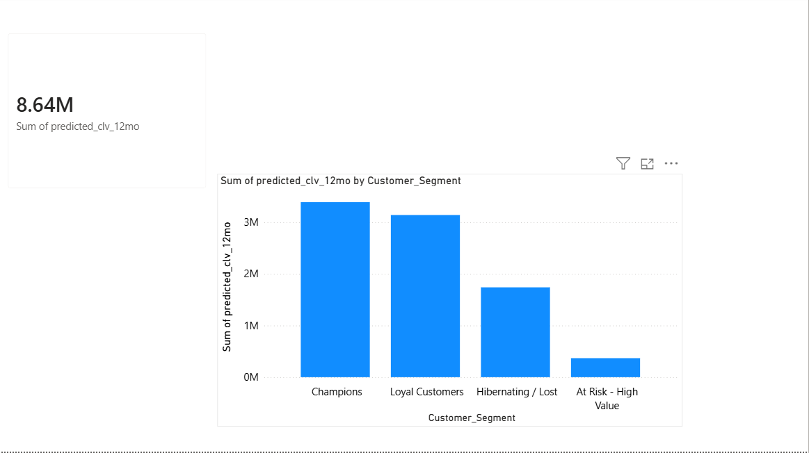

# End-to-End Predictive Customer Analytics & Data Engineering Pipeline


### 🖥️ Dashboard Quick View

#### Historical Performance Portfolio (Page 1)

#### Forward-Looking Predictive Valuation (Page 2)


# Automated E-Commerce Customer Analytics & 12-Month CLV Pipeline

## Business Impact Overview
This production-ready data analytics pipeline processes over **397K+ transactional records** to solve a critical retail problem: **Customer Retention and Revenue Forecasting.** Instead of treating all customers equally, this automated pipeline programmatically segments the customer base and accurately forecasts future revenue, enabling marketing teams to deploy targeted campaigns that maximize ROI and mitigate churn.

* **Identified "Slipping Champions":** Automatically flags high-value customer segments that haven't purchased in over 90 days, protecting critical revenue streams.
* **Predictive Revenue Forecasting:** Built a 12-Month Customer Lifetime Value (CLV) model allowing inventory and finance teams to project demand based on historical transaction behavior.
* **Operational Intelligence:** Designed a comprehensive SQL BI layer executing Pareto 80/20 distribution analytics, Month-over-Month (MoM) revenue growth trends, and segment-specific Average Order Value (AOV).

---

## Tech Stack & Architecture

* **Data Processing:** Python 3.11, Pandas, OpenPyXL
* **Database & BI Engine:** MySQL, SQLAlchemy, PyMySQL
* **Machine Learning Engine:** Lifetimes Framework (BG/NBD & Gamma-Gamma Models)
* **Visualization:** Power BI Desktop

### Data Flow Pipeline
1. **Raw Excel Data (397K+ rows)** -> Loaded via Pandas.
2. **Python ETL Pipeline (`etl_pipeline.py`)** -> Validates, cleans, and structures transaction logs.
3. **MySQL Database (`ecommerce_db`)** -> Stores data in core tables, feeds analytical scripts, and processes customer scores.
4. **ML Forecasting Engine (`clv_prediction.py`)** -> Computes BG/NBD frequency models and Gamma-Gamma spend metrics.
5. **Data Visualization Layer** -> Generates interactive executive reporting views via Power BI.

---

## Advanced SQL Analytical Engine

The core business logic is engineered directly into the database tier using advanced, optimized SQL (`business_insights_analysis.sql`). Key analytics implemented include:

1. **Month-over-Month (MoM) Growth Tracking:** Leverages `LAG()` window functions to dynamically monitor revenue acceleration metrics.
2. **Pareto 80/20 Analysis:** Implements cumulative window function sums (`SUM() OVER`) to isolate the exact cohort of core customers driving the top 80% of corporate revenue.
3. **Proactive Churn Alerts:** Dynamically filters database views to output list files of high-value customers showing signs of immediate churn.
4. **Strategic Average Order Value (AOV):** Aggregates cross-sectional data to compute exact baseline pricing models and basket size metrics across targeted customer tiers.

```sql
-- Code Sample: Isolating the Core 80% Revenue Drivers using Cumulative Window Functions
WITH CustomerRevenue AS (
    SELECT CustomerID, SUM(TotalLineRevenue) AS total_spend
    FROM fact_transactions 
    WHERE CustomerID IS NOT NULL 
    GROUP BY CustomerID
),
RunningTotals AS (
    SELECT CustomerID, total_spend,
        SUM(total_spend) OVER (ORDER BY total_spend DESC) AS cumulative_revenue,
        SUM(total_spend) OVER () AS total_company_revenue
    FROM CustomerRevenue
)
SELECT CustomerID, ROUND(total_spend, 2) AS total_spend,
    CASE WHEN (cumulative_revenue / total_company_revenue) <= 0.80 THEN 'Core 80% Revenue Driver'
    ELSE 'Long Tail Customer' END AS pareto_segment
FROM RunningTotals 
ORDER BY total_spend DESC;
```
---

## Predictive Modeling (ML Layer)
To move from historical analysis to proactive strategy, the pipeline utilizes statistical modeling frameworks to map future behavior:

* **BG/NBD Model (Beta-Geometric/Negative Binomial Distribution):** Predicts the expected number of repeat transactions a customer will make in a defined time horizon and calculates the active probability of each account.
* **Gamma-Gamma Model:** Evaluates the monetary value of future purchases, assuming no correlation between transaction frequency and monetary value.
* **Output:** Generates a granular, row-level 12-month expected spend projection per customer, pushed directly back to the database for dashboard integration.

---

## How to Run Locally

### 1. Database Setup
Ensure you have a local MySQL instance running. Create the database and build the core schema tracking layer:
```bash
mysql -u root -p < customer_rfm_view_final.sql
```
### 2. Install Pipeline Dependencies
```Bash
pip install pandas sqlalchemy pymysql lifetimes openpyxl
```
### 3. Execute the Pipelines
Run the automated ETL script to process raw files and push structured tables into the database engine:

```Bash
python etl_pipeline.py
```
Run the ML modeling loop to predict forward-looking performance metrics:

```Bash
python clv_prediction.py
```
### 4. Run Analytical Business Audits
Execute the strategic deep-dive metrics to answer business questions directly from your terminal or workbench interface:

```Bash
mysql -u root -p ecommerce_db < business_insights_analysis.sql
```
### Dashboard Key Features (Power BI)

Executive Scorecards: Real-time visibility into overall company AOV, Total Revenue, and Total Transaction Volume.

Strategic Segmentation Matrix: Visualized distribution of the RFM framework allowing marketing departments to click and extract distinct client cohorts for email targeting.

Forward Monetization Matrix: Displays predicted vs. actual revenue patterns allowing business users to visually inspect pipeline model efficacy.
